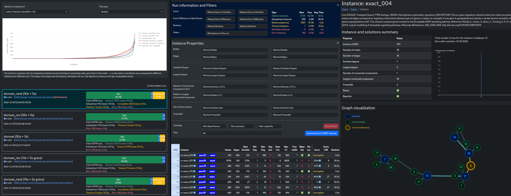

# STRIDE [](https://github.com/manpen/stride_runner_domset/actions/workflows/rust.yml)
see also:
 - [STRIDE website](https://domset.algorithm.engineering)
 - [Source code of the instance server](https://github.com/manpen/stride_server_domset)

The STRIDE system is designed as an *unofficial* companion to the [PACE 2025 Dominating Set challenge](https://pacechallenge.org/2025/ds/).
It provides a [large database of problem instances](https://domset.algorithm.engineering) and solutions.
We hope that this will help to produce more general solvers that have fewer bugs.

Since PACE is a competition, all solutions are kept secret until the end of the PACE challenge.
Until then, only the *score* of the best solution sofar is made available. 
Since solutions are verified upon upload, all published Dominating Set Cardinalities (scores) have been certified.

After the challenge is completed in June 2025, we will publish the solutions under a free license.
We hope to provide an interesting dataset (e.g., for machine learning) that way.
**The whole system is designed as a community effort. 
If you are using the instances, we kindly ask you to share your solutions, especially if they are better than the one we know so far.**
The STRIDE Runner makes that pretty easy.
Thank you!!!

## The STRIDE Runner


This small tool allows you to run your solver on a predefined sets of instances:
- Solvers can be started in parallel
- Downloading and caching of instances is done automatically
- You can define timeouts (until SIGTERM) and grace periods (until SIGKILL) to stop the solver
- Solutions are verified
- Solutions near or better than the best known solution are automatically uploaded to the server (can be disabled, but please don't 🙏)

### Additional Opt-In: Tracking your solution


As an added bonus you can "register" (see below) your solver --- which simply assigns a random UUID (v4) to your uploads.
In this mode, the runner will link all your uploads to this UUID and also upload some metadata (runtime, score, validity of solution) for failed runs.
You can then visualize and track the performance of your via a website.

## Getting the Runner
We currently support only Linux and plan to offer limited support to OSX (no Macs here ...). 
Any help is welcomed -- please file a pull request. 

### Getting a binary (Linux only)
As soon, as the code reaches a certain maturity, we will offer a binary release. 
In the mean time, you can download a static linux binary from the [GitHub action of this repo](https://github.com/manpen/stride_runner_domset/actions/workflows/rust.yml). 
Simply follow the link, click on the latest successful run, download `stride-runner_x86_64-unknown-linux-musl` from the *Artifacts* section on the bottom of the page.

### Build it from sources
Building from sources should be rather simple.
The only dependency we need is a [recent Rust installation](https://www.rust-lang.org/learn/get-started).
Afterwards simply run `cargo build --release` from within the source directory. This will produce a runner binary in the folder `target/release/runner`. That's it ... hopefully ;)

## Using the runner
The runner always operates relative to the current working directory.
For instance, if you want to track two different algorithms under separate Solver UUID and profiles, you can simply start the runner from two different folders to keep all data separate.
**Important:** Please avoid working in folders on network shares as this might result in corrupted databases (see FAQ).

### Setting up a new directory
To setup the runner the following commands suffices (for simplicity, we assume the runner and solver executables are in the current working directory; this is, however, not required):
```bash
> ./runner update     # retrieve ~150MB database dumps from server (see below)
> ./runner register   # OPTIONAL: sets a random solver uuid in `config.json` (see below)
```

With these steps, the runner creates the subfolder `.stride`.
Among others, it contains:
 - `metadata.db`: A SQLite database of the metadata of all instances currently available on the website.
 - `instances.db`: A SQLite database of some of the instance data; we automatically download all tiny graphs and fetch+cache larger instances on demand.
 - `config.json`: Here, you can enter default values for many command-line arguments to avoid typing (e.g., the Solver UUID, Path to Solver Binary, Timeouts, etc ..). This is the only file you might want to backup; everything else can be retrieved again from the server.

Currently, the `metadata.db` is **not** kept in sync with the server.
Thus is makes sense to run `./runner update` from time to time.
Observe that the server produces database dumps hourly; 
thus, it may take up to an hour for new information to become available.

### Executing your solver
The runner implements the same interface prescribed by PACE and optil.io:
 - You have to provide a solver executable (`--solver-bin`)
 - It has to read the solution in the [DIMACS format](https://pacechallenge.org/2025/ds/) from STDIN (the first node id is 1)
 - It has to provide the solution via STDOUT (observe that the first non-comment line needs to contain the cardinality of the solution!)
 - You can set a timeout in seconds (`-T`, `--timeout`).
   After this time the runner sends a `SIGTERM` to the solver, which should trigger some output routine. 
   After a grace period (`-G`, `--grace`) the solver is killed and its output disregarded.

The runner will start the solver for each instance in a predefined set.
By default, it executes `k` solvers in parallel where `k` is the number of hardware threads of your CPU.
You can use the `-j` argument to overwrite this setting.

Currently, the runner has two ways to select the instances to operate on:
 - Use the `-i` argument to point to a text file which has one Instance ID (IID) per line.
   Such a file can easily be generated using the [STRIDE web interface](https://domset.algorithm.engineering):
   Select a couple of constraints and then use the 'Download' button above the table to retrieve the list.
   You may edit it by hand, if necessary.   
   **Hint**: If you assign a Solver UUID, you can also add constraints based on your solver performance.
   For instance you can filter particularly bad/slow solver runs and download their IIDs to focus on the pain points ....

 - Use the `--where="X"` argument to issue an SQL query against your local database clone.
   This argument will result in the query `SELECT iid FROM Instance WHERE X` (see FAQ for info on the schema).
   If used in combination with `-i`, the solver will consider the intersection of both sources.
   Finally, you can use the `-e` argument to dump the instance into a file.

Examples:
```bash
# execute solver `./solver` on all instances stated in the file `demo.list`
# with a timeout of 30s and a grace period of 5s
./runner run -i demo.list --timeout 30 --grace 5 --solver-bin ./solver

# execute solver `./solver` on all instances with 123 nodes
# with a timeout of 10s and a grace period of 3s
./runner run --where "nodes = 123" -T 10 -G 3 --solver-bin ./solver 

# export a list of all graphs with 42 edges:
./runner run --where "edges = 42" -e edges42.list

# export a list of all instances present in `demo.list` with more than 1000 edges:
./runner run -i demo.list --where "edges > 1000" -e edges1000.list

# execute solver `./solver` on all known instances and highlight 
# suboptimal solutions (see section `Troubleshooting`)
./runner run --where "1=1" --suboptimal-is-error --solver-bin ./solver 

# Show a help for the command itself (first) and the `run` subcommand (second)
./runner --help
./runner run --help
```

### Troubleshooting

For each run the runner creates a directory `stride-logs/{DATE}_{TIME}_{RUN-UUID}`.
Within this directory it places for each instance `i` three files:
 - `iid{i}.stdin.gr`: contains the input fed to your solver
 - `iid{i}.stdout` / `idd{i}.stderr`: the responses of your solver

By default these files will be deleted for all runs which gave a feasible Dominating Set.
Results are only retained for failed/timeout/infeasible runs. 
The behavior can be changed:
 - By passing the `-o`/`--suboptimal-is-error` argument, the runner will highlight suboptimal solutions more prominently during the run and retain the stdin-stdout-stderr triple for all non-optimal solutions.
 - By passing the `-k`/`--keep-logs-on-success` argument, the runner will keep all logs.

In case the runner itself misbehaves, it might help to enable logging by passing the `-l` / `--logging` with values (`info`, `debug`, `trace`) **in front** of the command:

```bash
./runner --loggin trace run -i demo.list
```

## Data protection
**We are not interested in your personal data** and designed the whole system in good faith to collect as little data as possible:
- Your solver never leaves your machine
- The runner only uploads normalized solutions (sorted without comments) and metadata, such as runtime, error codes and solution scores
- There is **no registration** process where we ask for your name, mail, or affiliation.
  If you want to track your solutions over time, you can **opt-in** by selecting a random *Solver UUID* --- that is the only identification
- You can annotate each run with a name and description; this information will not be included in the final data dump
- We do not store your IP address in our database (though we may enable short-term access logs for debugging purposes)
- Until the end of the PACE challenge, we, the operators, will only use the publicly information

## FAQ

### Getting in touch
- **Q:** How can I contact you?

  Please feel free to contact us using:
    - An Issue / Pull Request on GitHub in the [Runner Repository](https://github.com/manpen/stride_runner_domset/)
    - An Issue / Pull Request on GitHub in the [Server Repository](https://github.com/manpen/stride_server_domset/)
    - An E-Mail to Manuel at `stride@algorithm.engineering`
    - ... ?

- **Q:** Can I add problem instances?

  YES, we'd love to have your problems ;) Just write an E-Mail to Manuel.

### Database

- **Q:** Help! I accidentally typed `; DROP TABLE Instance` during my SQL query.
  
  Well that happens to best of us ... simply delete `.stride/metadata.db` (and if necessary `.stride/instance.db`) and run `./runner update`.

- **Q:** There are SQLite errors due to corrupted database images.

  Recover using the steps above. We encountered that problem once, when multiple runners were executed on a network mount.

- **Q:** What columns can I query against?

  At time of writing, the `Instance` Table has the following columns:
```sql
CREATE TABLE IF NOT EXISTS "Instance" (
        "iid" INTEGER PRIMARY KEY AUTOINCREMENT,
        "data_did" INTEGER NOT NULL  ,
        "nodes" INTEGER NOT NULL  ,
        "edges" INTEGER NOT NULL  ,
        "name" VARCHAR(255) NULL  ,
        "description" TEXT NULL  ,
        "submitted_by" VARCHAR(255) NULL  ,
        "created_at" DATETIME NOT NULL DEFAULT CURRENT_TIMESTAMP ,
        "min_deg" INTEGER NULL  ,
        "max_deg" INTEGER NULL  ,
        "num_ccs" INTEGER NULL  ,
        "nodes_largest_cc" INTEGER NULL  ,
        "planar" TINYINT NULL  ,
        "bipartite" TINYINT NULL  ,
        "diameter" INTEGER NULL  ,
        "treewidth" INTEGER NULL  ,
        "best_score" INTEGER NULL
);
```

  It is an ordinary SQLite stored in the file `.stride/metadata.db`.
  Feel free to interact with the DB in different ways, e.g., using the `sqlite3 .stride/metadata.db`.

